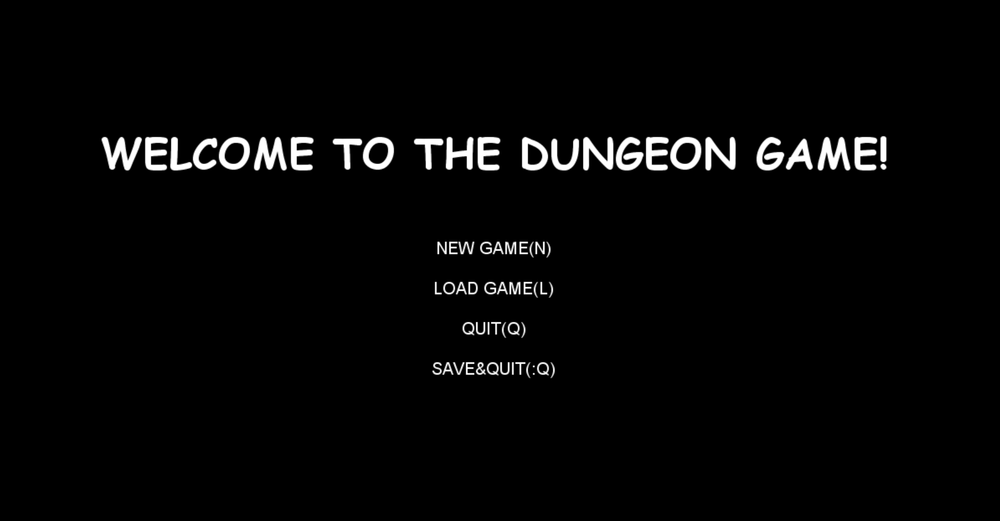

# Dungeon-Game

## Intro

Dungeon game, inspired by UCB CS61B Spring 2018-project 2, is a game coded in Java that can generates random dungeon maps and players can play with keyboard.

Here is a demo: https://youtu.be/POXy4pmhIcM

## Features

* Creates random dungeon maps with different random seed.
* Designed and implemented HUD (player's HP, time and tile descriptions) and GUI with StdDraw for users to play the game with keyboard and displaying game information.
* Game can be saved and loaded again.
* Player can collect coins to increase their HP.
* Player need to get to the door(the yellow square) before time runs out to win the game.

